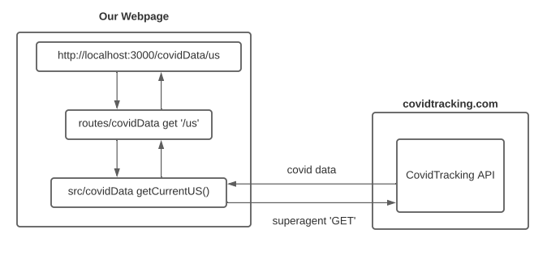
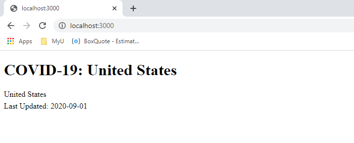

# covid19-website

Welcome to UMN App Developers Club! 

This is a tutorial that teaches you how to use an API, create a basic webpage, and display a set of data. For this tutorial specifically, we are going to queue the most recent COVID-19 data in the United States on cases, testing, mortality, and hospital numbers in the US as a whole and divided up by each of the fifty states. The entire webpage is written in basic HTML, CSS, Javascript. The data is gathered from an external, public api listed in reources below.

Estimated time to complete all parts: **2 hours**

## Part 0 - Project Structure and Setup

### Prerequisites
 - A basic understanding of programming, http, and apis
 - Git installed [Install Here](https://git-scm.com/downloads)
 - Github account either personal or through the University of Minnesota [Github](https://github.com/) [UMN Github](https://github.umn.edu/login)
 - Have Chrome or Firefox installed. This short demo does not 'currently' work on internet explorer

### File Structure
 - `data`: Contains static data about US states and abbreviations that match that of CovidTracking
 - `html`: Contains all of the front end interactions like functionality, making http requests, and style
 - `images`: Contains images for README
 - `routes`: Contains the middleware web framework and routing for requests made by the webpage
 - `src`: Contains all of the http requests for grabbing the covid19 data from external sources

 ### Operational Structure
Here is the structure for how the webpage makes requests and gathers data

**Note:** Good design practice is to keep your execution logic and intents separated from your express routes



### Setup
 1. Clone this repository to your local machine
    - [How To Clone](https://docs.github.com/en/github/creating-cloning-and-archiving-repositories/cloning-a-repository)
 2. Open the project in an IDE or code editor at its root directory
    - [Visual Studio Code Install](https://code.visualstudio.com/download)
 3. Run `npm init` if there is no `package.json` file
    -  ENTER on everything prompted and confirm "yes"
 4. Install the following dependencies. `npm install` also works if package.json is specified
    - `npm install express`
    - `npm install superagent`
    - `npm install moment`
 5. Run `npm run server`

If everything you did is working correctly, you should be able to open your browser to `http://localhost:3000/` and see the following:



## Part 1 - How To Use An API and Express
An API, or application programming interface, is used to make calls or requests for computer permissions, update data, or in our instance,
gather data. Express is a web framework that helps 'route' calls easily and very simply through nodejs javascript. For our purposes, we will use it to test your `src` and used to make calls for data and project files to our webpage

You are going to be using a library called `superagent` to make GET requests for covid19 data located in `src/covidData.js` and `src/`. There are multiple unfilled request for data that need to be filled by making the correct calls to the CovidTracking api. There are examples to show you how it works. In order to complete this part, you have to read and understand how to get data from the website: `https://covidtracking.com/data/api`

Everything to do in this part are marked with "TODO Part 1" for finding.
 - `files.js`
 - `covidData.js`

## Part 2 - Google Charts and jQuery

### Google Charts
Google Charts is a great and basic method to display sets of data. They have all sorts of graphs to display your data. We will only be using the line
charts for trends in data over time. There are examples of displaying trend data in `html/website.js` and more on their website `https://developers.google.com/chart/`

You are going to be using these examples to build the `createHospitalTrend()` function to create a line graph for current hospital numbers

### jQuery
jQuery is for our purposes, used to call the express routes that you used to test with earlier. There is an example o fhow to use jQuery to call your
express functions at `website.js Line 37`

Everything to do in this part are marked with "TODO Part 2" for finding.
 - `website.js`

## Heroku
You can deploy this web app to a hosting service for free called [Heroku](https://www.heroku.com/). Heroku randomly assigns ports on calling your website, so you need to replace the following line:

```
app.listen(port, () => {
``` 

to 

```
app.listen(process.env.PORT || port, () => {
```

Steps to deploy it:
1. Ensure that the project is up to date on your github repository
2. Make an account on Heroku
3. Go to the Heroku Dashboard and "Create App"
4. Use "Connect with Github" and link it to your repository

## Congratulations
Congratulations!!!
You have now made a fully functioning localhost server and website you can view online for gathering and nicely displaying covid19 data. Feel free to expand on these by adding more displays, adding countries, or better data analysis or playing with the data

## Resources
 - United States and Individual State's Data: [Covid Tracking Data API](https://covidtracking.com/data/api)
 - All of the graphs are built using [Google Charts](https://developers.google.com/chart/)
 - The design of this website was heavily inspired from the [Johns Hopkins University COVID-19 Dashboard](https://gisanddata.maps.arcgis.com/apps/opsdashboard/index.html#/bda7594740fd40299423467b48e9ecf6)

## Created By
Avery Swank (swank026@umn.edu)
